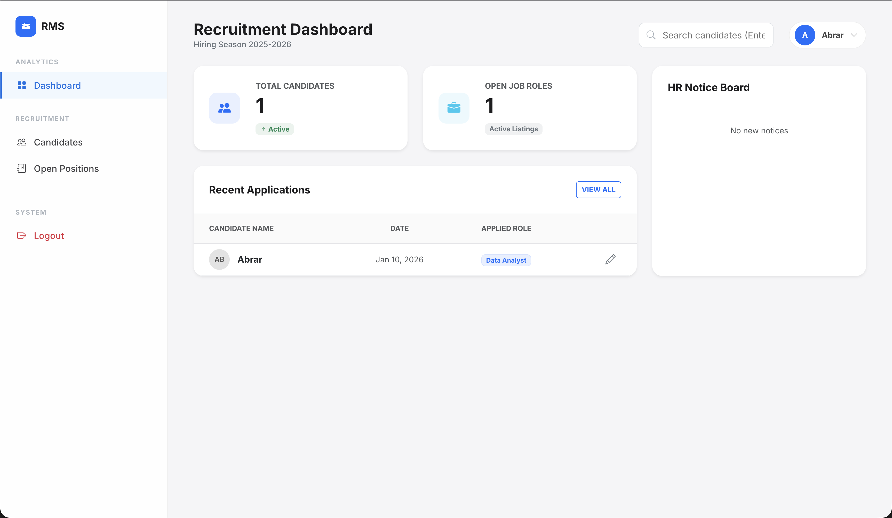

# Recruitment Management System (RMS) 👔



A modern, responsive, and full-stack web application designed for HR departments to streamline recruitment pipelines, track job postings, and manage candidate applications efficiently. Built with a focus on clean Enterprise UI/UX and a robust Django backend.

## 🚀 Key Features

### 📊 Analytics & Reporting
* **Interactive Dashboard:** Live real-time counters for "Total Candidates" and "Open Positions," featuring a dynamic "Recent Applications" table.
* **Visual Analytics:** Integrated Chart.js visualization displaying candidate distribution across different job roles.
* **Data Export:** One-click CSV export functionality to download candidate data for offline analysis and reporting.

### 🎨 Frontend & Design
* **Zero-JS Dropdowns:** Innovative pure CSS implementation for interactive profile menus, ensuring high performance without JavaScript overhead.
* **Modern "Glassmorphism" UI:** Features a card-glass aesthetic with translucent backgrounds and soft shadows for a premium, modern look.
* **Responsive Sidebar:** A fixed, intuitive navigation bar that adapts seamlessly to different screen sizes.

### ⚙️ Backend (Django)
* **Full CRUD Operations:**
    * **Create:** Post new Job Roles and add Candidate profiles via secure, validated forms.
    * **Read:** Dynamic searchable directories for Candidates and Jobs with pagination support.
    * **Update:** Pre-filled forms to easily edit existing job listings or candidate details.
    * **Delete:** Secure confirmation pages with POST request protection to prevent accidental data loss.
* **Relational Database:** Implements robust `ForeignKey` relationships between Candidates and Job Roles (One-to-Many architecture).
* **Authentication Flow:** Secure Login, Register, and Forgot Password interfaces routed through Django's built-in authentication system.

## 🛠️ Tech Stack

* **Frontend:** HTML5, CSS3, Bootstrap 5.3, Bootstrap Icons, Chart.js.
* **Backend:** Python 3.12, Django 5.0+.
* **Database:** MySQL (Production Ready).
* **Architecture:** Django MVT (Model-View-Template).

## 📂 Project Structure

```text
RECRUITMENT-MANAGEMENT-SYSTEM/
├── manage.py              # Django Task Manager
├── sms/                   # Project Configuration
│   ├── settings.py        # Database & App Config
│   └── urls.py            # Main Router
├── students/              # Main Application Logic
│   ├── models.py          # Database Schema (Candidate, JobRole)
│   ├── views.py           # Controller Logic & Analytics
│   └── urls.py            # App-specific Routes
├── static/                # Static Assets
│   └── css/
│       └── style.css
└── templates/             # HTML Views
    ├── dashboard.html     # Analytics Dashboard
    ├── students.html      # Candidate Directory
    ├── courses.html       # Job Postings
    └── ... (other pages)
```

## 🔧 Installation & Setup

Follow these steps to run the project locally on your machine.

**1. Clone the Repository**

```bash
git clone [https://github.com/Abrar-Khaleel/recruitment-management-system.git](https://github.com/Abrar-Khaleel/recruitment-management-system.git)
cd recruitment-management-system

```

**2. Create a Virtual Environment**

```bash
# Windows
python -m venv .venv
.venv\Scripts\activate

# Mac/Linux
python3 -m venv .venv
source .venv/bin/activate

```

**3. Install Dependencies**

```bash
pip install django mysqlclient

```

**4. Configure Database**

* Ensure you have a MySQL database named `sms_db` created.
* Update `sms/settings.py` with your MySQL credentials if necessary.

**5. Apply Database Migrations**

```bash
python manage.py makemigrations
python manage.py migrate

```

**6. Create Admin User**

```bash
python manage.py createsuperuser

```

**7. Run the Development Server**

```bash
python manage.py runserver

```

Open your browser and navigate to: `http://127.0.0.1:8000/`

## 🔮 Future Scope

* **Email Notifications:** Automated emails to candidates upon application status changes.
* **Resume Parsing:** Integration with AI to automatically extract skills from uploaded resumes.
* **Interview Scheduling:** A calendar module to book and manage interview slots.

---


```

```
